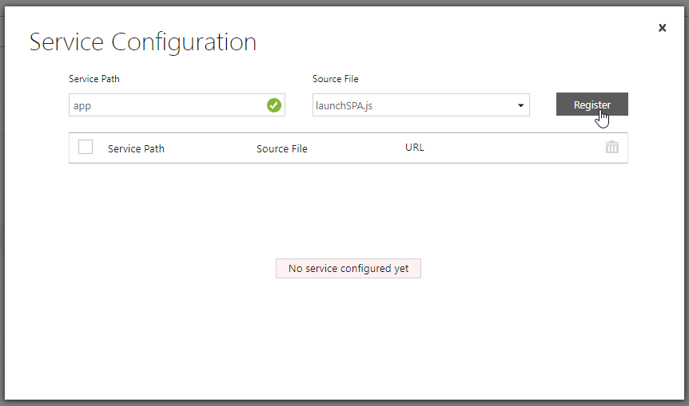
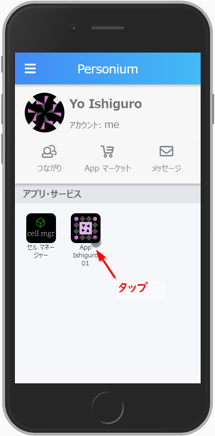
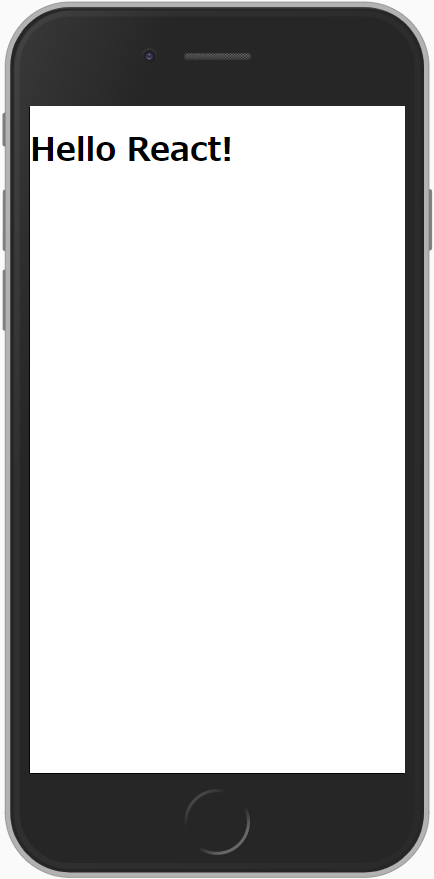

# personium-blank-app

React.jsを使用したPersoniumアプリを開発するためのテンプレートです。

本コードを使用することで、「Personiumを使ったアプリ」ではなく「Personiumアプリ」を構築することが可能です。

[「Personium アプリ」と「Personium を使ったアプリ」](https://personium.io/docs/ja/app-developer/)

## 手順

### 設定ファイルの更新

#### ビルド・デプロイ設定

`config.example.js` → `config.js` へリネームし、修正します。

```js
module.exports = {
  personium: {
    CELL_NAME: '<CELL_NAME>',             // アプリセル名
    CELL_FQDN: '<CELL_FQDN>',             // アプリセル名.ユニットFQDN
    CELL_ADMIN: '<ADMIN_USERNAME>',       // rootユーザーID
    CELL_ADMIN_PASS: '<ADMIN_PASSWORD>',  // rootユーザーパスワード
  // 中略
  }
};
```

#### アプリセル設定

`src/assets/launch.example.json` → `src/assets/launch.json` へリネームし、修正します。

```json
{
  "personal": {
    "web": "https://<CELL_FQDN>/__/front/app",
    "android": "***:",
    "ios": "***;"
  }
}
```

- `<CELL_FQDN>` にはアプリセルのFQDNを入力します。

#### ユーザーセル内アプリ設定①

`src/bar/00_meta/00_manifest.example.json` → `src/bar/00_meta/00_manifest.json` へリネームし、修正します。

```json
{
  "bar_version": "2",
  "box_version": "1",
  "default_path": "<DEFAULT_BOX_NAME>",
  "schema": "<APP_CELL_FQDN>"
}
```

- `<DEFAULT_BOX_NAME>` にはユーザーセル内で使用するbox名を入力します。
- `<APP_CELL_FQDN>` にはアプリセルのFQDNを入力します。

#### ユーザーセル内アプリ設定②

`src/bar/00_meta/90_rootprops.example.xml` → `src/bar/00_meta/90_rootprops.xml` へリネームします。

### ビルド

#### barファイルのビルド

ユーザーにインストールしてもらうbarファイルをビルドします。

```bash
npm run build-bar
```

`dist/{アプリセル名}.bar` というファイルが生成されていれば成功です。これをユーザーのセルでインストールします。

#### アプリのビルド

アプリのビルドは下記コマンドで実行します。

```bash
npm run build-app
```

ビルドしたものは `build` フォルダ配下に配置されます。

### デプロイ

#### ビルド生成物のアップロード

下記コマンドを実行することで先程のコマンドでビルドしたファイルをアップロードします。

```bash
npm run deploy
```

#### ACLの設定

ACLの設定は手動で行います。

1. `/__/front` の all に exec を付与します。
1. Service `/__/front` 内のスクリプト `launghSPA.js` に ServicePath `app` という名前を付けます。

（※本設定は`npm run deploy` 時に自動で設定するように変更になったため、必要なくなりました。）
1. `/__/public` の all に read を付与します。

#### アプリ情報の開示設定

下記4ファイルの all に read を付与します。

- launch.json
- profile.json
- relations.json
- roles.json

## 実行

barをインストールしたユーザーのホームアプリからアイコンをクリックするとアプリが起動します。





このとき、実行されるのは、`src/app/frontend/index.js` に実装されたコードです。

```es6
import React from 'react';
import ReactDOM from 'react-dom';

ReactDOM.render(
  <h1>Hello React!</h1>,
  document.getElementById('root')
);
```

本コードを修正することでReact.jsを使用した、SPAアプリケーションを開発することができます。
