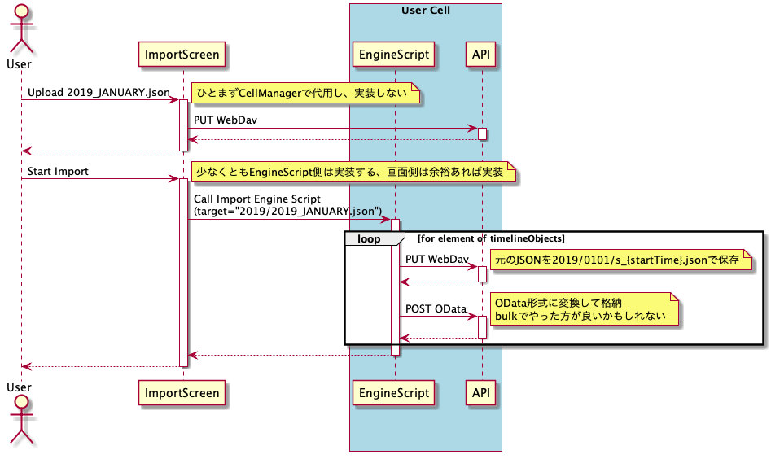
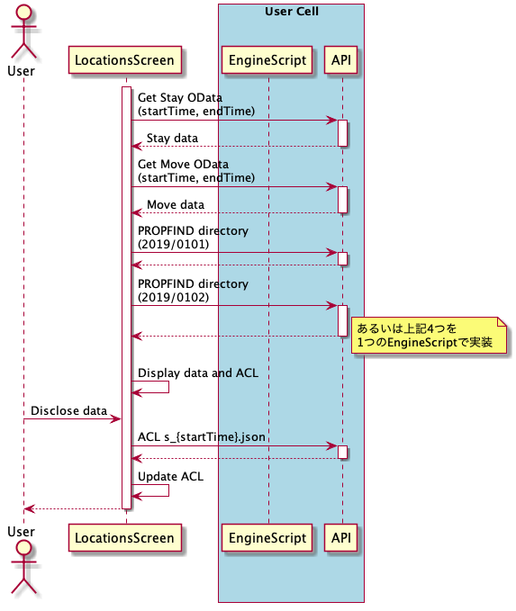
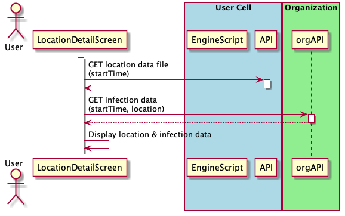

# Personium Trails design

## Preparation

### User Cell

- bar install
  - OData schema
  - Role (開示先がアクセスするRole)

### App Cell

- Account
- OAuth2 Code flow Engine Scripts

## Screens

- import
- location list
- location detail

## Sequences

### Import Screen

### Locations Screen

### Location detail Screen

